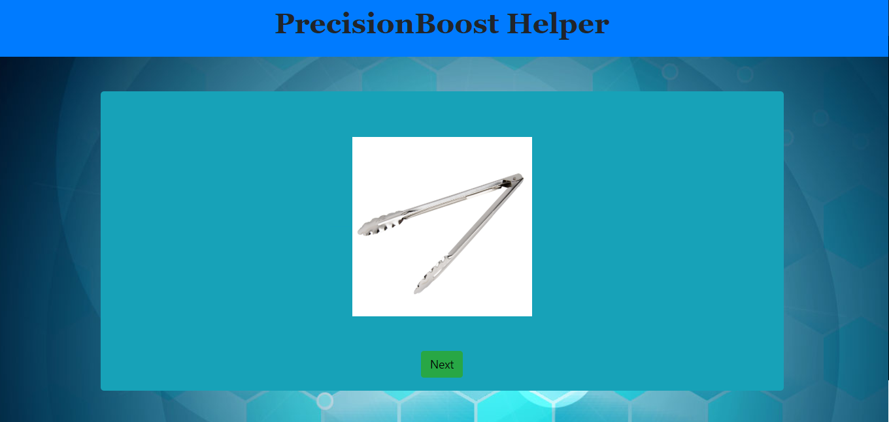

# Precision Teaching Online
Full-stack application for facilitating applied behavior analysis programs using Precision Teaching.

# About Precision Teaching
---
In the clinical field of applied behavior analysis, certified therapists treat individiuals for various developmental and academic delays through manipulation of the environment and breaking down tasks into individual skills to be practiced. One of the most powerful methods used to build the skills of clients is called precision teaching. Precision teaching endeavors to increase the accuracy and speed of a client's responses in order to build fluency and enduring gains in delayed skills. 

Precision teaching trials are often short and frequently involve the presentation of a stimulus followed by a client response, which is typically recorded as rate of responses per minute. These fluency trials are interspered in the midst of teaching trials and are used to track client progress and growth. 

# How Precision Teaching Online helps

For many skills, such as labeling letters when presented, pictures are used for these fluency trials. An instructor will typically flip through the pictures in the name manner as flash cards. However, the mechanical motion of the instructor's fingers puts a limit on how high a client's scores may reach. Additionally, cards may be accidentally dropped, mixed, or misplaced.

Precision Teaching Online allows therapists to create client profiles, add programs, and change resources for their programs with ease. When they desire to run a trial with a client, they need only select the trial and click "start", then press the "next" button when the client responds.

With the advent and rapid growth of online services, being able to run a program entirely from resources on the internet has become more convenient than ever. A therapist simply needs to share their screen to present the trial to the client
